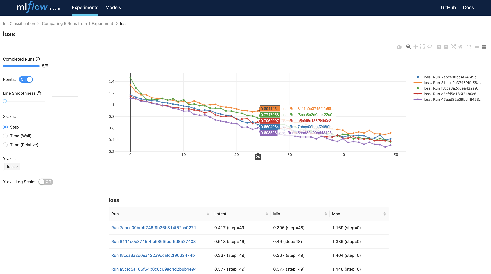

# ML-Ops

MLOps with mlflow.

This repository is based on MLFlow, Docker, Docker-Compose, MySql and AWS S3.

> Required python 3.9, mlflow 1.27.0

    

## Quick Start
- [For ML Developers](client/README.md)
- [For Infra Managers](server/README.md)

These guides are for mlflow usage and simple settings. If you are a infra developer and plan to set up MLOps, read the below section. 

## MLOps Setting Docs
1. Running tracking server with S3 & Mysql
2. Building a image using a model artifact 
3. Tracking & Tagging the model
4. Appendix
    - Running tracking server locally
    - Serving your model directly
    - [Useful Rest API](Docs/4.%20Appendix/RestAPI.md)

## Examples
- Iris Classfication
- MNIST

## License
- MIT

## Author
- Quqqu
    - answeqr@gmail.com
    - [github](https://github.com/QuqqU)
