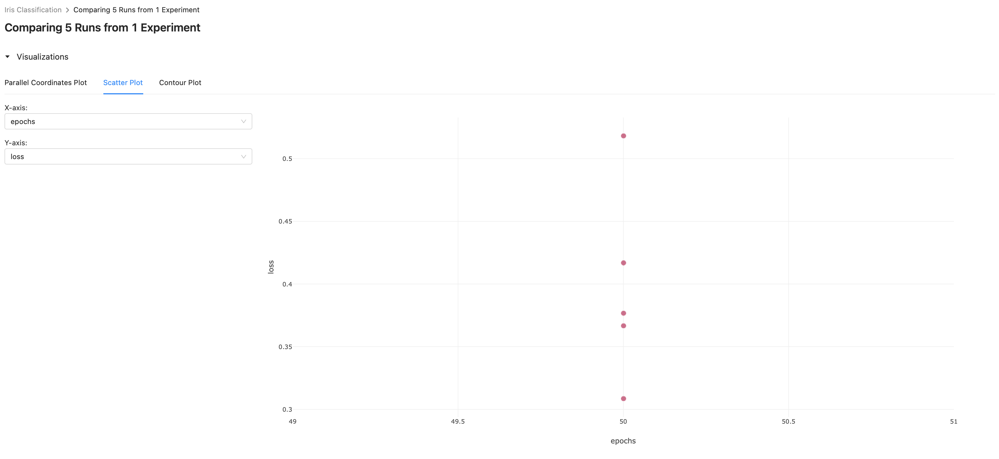

# Guide for ML Developers

## How to track your runs

```
export MLFLOW_TRACKING_URI=http://localhost:5000
```
Set env variable to indicate where mlflow tracking server is.

<div align="center">
    
</div>

```
mlflow run MNIST --env-manager=local --experiment-name="test"
```

Run your model in a local virtual environment that can be created by `virtualenv`, and track your run with an experiment named "test". You can see `--no-conda` command which is deprecated, so use `--env-manager=local` instead.

Be sure to run this command in the virtual environment, if you specify `--no-conda` or `--env-manager=local`. If not specify these options, mlflow runs using conda environment.

If you don't indicate `--experiment-name`, the run is tracked with an `Default` experiment of which `--experiment-id` is zero.


## Track and Compare runs

<div align="center">
    
    
    
    
</div>

You can track your model, and compare metrics in the same experiment.

## More info

See more in [databricks guide](https://docs.databricks.com/applications/mlflow/quick-start.html).